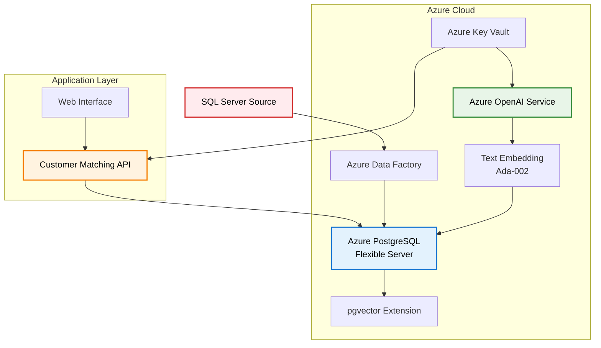

# Customer Matching POC - PostgreSQL with pgvector

A proof of concept for customer account matching using Azure Database for PostgreSQL with the pgvector extension and Azure OpenAI embeddings.

## 🏗️ Architecture Overview



## 🚀 Features

- **Vector Similarity Search**: Uses pgvector extension for efficient similarity matching
- **Azure OpenAI Integration**: Generates embeddings using text-embedding-ada-002
- **RESTful API**: FastAPI-based service for customer matching operations
- **Automated Matching**: PostgreSQL functions for intelligent customer matching
- **Multiple Match Types**: Exact, high confidence, potential, and low confidence matches
- **Web Interface**: Simple HTML interface for testing and exploration
- **Production Ready**: Includes security, monitoring, and scalability considerations

## 📋 Prerequisites

- Azure subscription with appropriate permissions
- Azure CLI installed and configured
- Python 3.8+ for the application
- PostgreSQL client tools (psql) for database setup
- Git for version control

## 🛠️ Quick Start

### 1. Deploy Infrastructure

```bash
# Make the deployment script executable
chmod +x deploy-infrastructure.sh

# Run the deployment
./deploy-infrastructure.sh
```

**⚠️ Important: Parameter File Security**

Before deploying, you need to create your parameter file with actual values:

```bash
# Copy the template file
cp bicep/postgresql-pgvector.parameters.template.json bicep/postgresql-pgvector.parameters.json

# Edit with your actual values
# NEVER commit the .parameters.json file to source control!
```

Required parameter updates:
- `adminPassword`: Strong password for PostgreSQL admin
- `clientIpAddress`: Your current IP address for firewall access

The script will:
- Create Azure resource group
- Deploy PostgreSQL Flexible Server with pgvector
- Set up Azure OpenAI service
- Configure Key Vault for secrets
- Create Data Factory for data migration
- Generate application configuration

### 2. Set Up Database

```bash
# Connect to PostgreSQL and run setup script
psql -h your-postgresql-server.postgres.database.azure.com -U pgadmin -d customer_matching -f sql/01-setup-pgvector.sql
```

### 3. Configure Application

```bash
# Navigate to app directory
cd app

# Copy and edit environment configuration
cp .env.example .env
# Edit .env with your actual values (especially OpenAI API key)

# Install Python dependencies
pip install -r requirements.txt
```

### 4. Start Application

```bash
# Run the FastAPI application
python main.py

## 📊 Generating and Importing Customer Data

### Generate and Import Sample Data
To generate and import sample customer data (500 records by default):

```bash
# Navigate to the app directory
cd c:\dev\az-vectordb\app

# Import sample data with random embeddings (default)
python -m import.import_customers

# Import with a specific number of records
python -m import.import_customers --count 1000

# Use real OpenAI embeddings (requires valid API key in .env)
python -m import.import_customers --use-real-embeddings
```

### Import from External Files
You can also import customer data from CSV or JSON files:

```bash
# Import from CSV file
python -m import.import_customers --source path/to/customers.csv

# Import from JSON file
python -m import.import_customers --source path/to/customers.json

# Explicitly specify file format (optional, auto-detected from extension)
python -m import.import_customers --source data.csv --format csv
```

### File Formats

**CSV Format:**
```csv
company_name,contact_name,email,phone,address_line1,address_line2,city,state,postal_code,country,industry,revenue,employee_count,website,description
Acme Corp,John Smith,john.smith@acmecorp.com,555-123-4567,123 Main St,,New York,NY,10001,USA,Technology,10000000,150,https://acmecorp.com,Leading technology solutions provider
```

**JSON Format:**
```json
[
  {
    "company_name": "Acme Corp",
    "contact_name": "John Smith",
    "email": "john.smith@acmecorp.com",
    "phone": "555-123-4567",
    "address_line1": "123 Main St",
    "city": "New York",
    "state": "NY",
    "postal_code": "10001",
    "country": "USA",
    "industry": "Technology",
    "revenue": 10000000,
    "employee_count": 150,
    "website": "https://acmecorp.com",
    "description": "Leading technology solutions provider"
  }
]
```

The application will be available at:
- **Web Interface**: http://localhost:8000
- **API Documentation**: http://localhost:8000/docs
- **Health Check**: http://localhost:8000/health
```

## 📊 API Endpoints

### Core Operations

| Method | Endpoint | Description |
|--------|----------|-------------|
| GET | `/` | Web interface |
| GET | `/health` | System health check |
| POST | `/customers` | Add new customer |
| GET | `/customers` | List all customers |
| POST | `/customers/incoming` | Submit incoming customer |
| POST | `/customers/match/{id}` | Process customer matching |
| POST | `/customers/search` | Text-based similarity search |
| GET | `/matches/{id}` | Get matching results |

### Example Usage

#### Add a Customer
```bash
curl -X POST "http://localhost:8000/customers" \
  -H "Content-Type: application/json" \
  -d '{
    "company_name": "Acme Corporation",
    "contact_name": "John Smith",
    "email": "john.smith@acme.com",
    "city": "New York",
    "industry": "Technology"
  }'
```

#### Submit Incoming Customer for Matching
```bash
curl -X POST "http://localhost:8000/customers/incoming" \
  -H "Content-Type: application/json" \
  -d '{
    "company_name": "ACME Corp",
    "contact_name": "J. Smith",
    "email": "jsmith@acmecorp.com",
    "city": "NYC",
    "industry": "Tech"
  }'
```

#### Process Matching
```bash
curl -X POST "http://localhost:8000/customers/match/1"
```

#### Search Similar Customers
```bash
curl -X POST "http://localhost:8000/customers/search" \
  -H "Content-Type: application/json" \
  -d '{
    "query_text": "technology company in New York",
    "similarity_threshold": 0.8,
    "max_results": 5
  }'
```

## 🗄️ Database Schema

### Tables

- **customers**: Main customer database with vector embeddings
- **incoming_customers**: New customer requests to be matched
- **matching_results**: Results of matching operations

### Key Features

- **Vector Indexes**: HNSW indexes for fast similarity search
- **Generated Columns**: Automatic search text generation
- **Stored Functions**: PostgreSQL functions for matching logic
- **Similarity Scoring**: Cosine similarity with configurable thresholds

## 🔧 Configuration

### Environment Variables

| Variable | Description | Default |
|----------|-------------|---------|
| `POSTGRES_HOST` | PostgreSQL server hostname | - |
| `POSTGRES_PASSWORD` | Database password | - |
| `AZURE_OPENAI_ENDPOINT` | OpenAI service endpoint | - |
| `AZURE_OPENAI_API_KEY` | OpenAI API key | - |
| `DEFAULT_SIMILARITY_THRESHOLD` | Default similarity threshold | 0.8 |
| `HIGH_CONFIDENCE_THRESHOLD` | High confidence threshold | 0.9 |
| `POTENTIAL_MATCH_THRESHOLD` | Potential match threshold | 0.75 |

### Similarity Thresholds

- **Exact Match**: ≥ 0.95 similarity
- **High Confidence**: ≥ 0.85 similarity
- **Potential Match**: ≥ 0.75 similarity
- **Low Confidence**: < 0.75 similarity

## 🔍 Monitoring and Troubleshooting

### Health Checks

The `/health` endpoint provides system status:
- Database connectivity
- Azure OpenAI connectivity
- Application version and timestamp

### Logging

Application logs include:
- Customer creation and matching operations
- Embedding generation status
- Database operations
- Error details and stack traces

### Common Issues

1. **pgvector Extension Not Found**
   ```sql
   CREATE EXTENSION IF NOT EXISTS vector;
   ```

2. **OpenAI API Key Issues**
   - Verify key in Azure Portal
   - Check endpoint URL format
   - Ensure deployment is active

3. **Database Connection Issues**
   - Verify firewall rules
   - Check SSL requirements
   - Validate connection string

## 📈 Performance Considerations

### Vector Index Optimization

```sql
-- Adjust HNSW parameters for your data size
CREATE INDEX idx_customers_profile_embedding ON customer_data.customers 
USING hnsw (full_profile_embedding vector_cosine_ops) 
WITH (m = 16, ef_construction = 64);
```

### Batch Processing

- Process embeddings in batches of 16
- Use connection pooling for database
- Implement rate limiting for OpenAI API

### Scaling Recommendations

- **Small Dataset** (< 10K customers): Current setup
- **Medium Dataset** (10K-100K): Increase PostgreSQL compute
- **Large Dataset** (> 100K): Consider read replicas and caching

## 🔒 Security Best Practices

### Implemented Security

- SSL/TLS encryption for all connections
- Azure Key Vault for secret management
- Network security groups and firewall rules
- Azure AD integration capabilities

### Parameter File Security

**🔒 Critical Security Practice:**

- **Template files** (`*.parameters.template.json`) are safe to commit and contain placeholder values
- **Actual parameter files** (`*.parameters.json`) contain sensitive data and are automatically excluded by `.gitignore`
- **Never commit** files with real passwords, IP addresses, or connection strings

**Recommended workflow:**
```bash
# 1. Copy template to create your parameter file
cp bicep/postgresql-pgvector.parameters.template.json bicep/postgresql-pgvector.parameters.json

# 2. Edit with actual values (this file won't be committed)
# 3. Deploy using the actual parameter file
# 4. For production, use Azure Key Vault references instead
```

**Production approach:**
```json
{
  "adminPassword": {
    "reference": {
      "keyVault": {
        "id": "/subscriptions/{sub}/resourceGroups/{rg}/providers/Microsoft.KeyVault/vaults/{vault}"
      },
      "secretName": "postgresql-admin-password"
    }
  }
}
```

### Additional Recommendations

- Enable Azure AD authentication for PostgreSQL
- Use managed identities for service connections
- Implement API rate limiting and authentication
- Regular security updates and monitoring

## 💰 Cost Optimization

### Current Estimated Costs (Monthly)

| Service | Configuration | Estimated Cost |
|---------|---------------|----------------|
| PostgreSQL Flexible Server | Standard_D2s_v3 | $150-200 |
| Azure OpenAI | Standard tier | $50-150 |
| Storage | 128GB + backups | $20-30 |
| Key Vault | Standard | $5 |
| **Total** | | **$225-385** |

### Cost Optimization Tips

- Use reserved instances for predictable workloads
- Implement auto-scaling for variable loads
- Monitor and optimize embedding API usage
- Regular cleanup of old matching results

## 🚀 Production Deployment

### Infrastructure as Code

All infrastructure is defined in Bicep templates:
- `bicep/postgresql-pgvector.bicep`: Main infrastructure
- `bicep/postgresql-pgvector.parameters.json`: Environment parameters

### CI/CD Pipeline

Recommended pipeline stages:
1. **Build**: Install dependencies, run tests
2. **Deploy Infrastructure**: Bicep template deployment
3. **Database Migration**: Apply schema changes
4. **Application Deployment**: Deploy to App Service or AKS
5. **Integration Tests**: Validate end-to-end functionality

### Monitoring

- Application Insights for application monitoring
- Azure Monitor for infrastructure metrics
- Custom dashboards for business metrics
- Alerting for critical failures

## 🤝 Contributing

1. Fork the repository
2. Create a feature branch
3. Make your changes
4. Add tests for new functionality
5. Submit a pull request

## 📄 License

This project is licensed under the MIT License - see the LICENSE file for details.

## 📞 Support

For issues and questions:
- Check the troubleshooting section
- Review application logs
- Open an issue in the repository
- Contact the development team

---

**Built with ❤️ using Azure, PostgreSQL, and Python**
