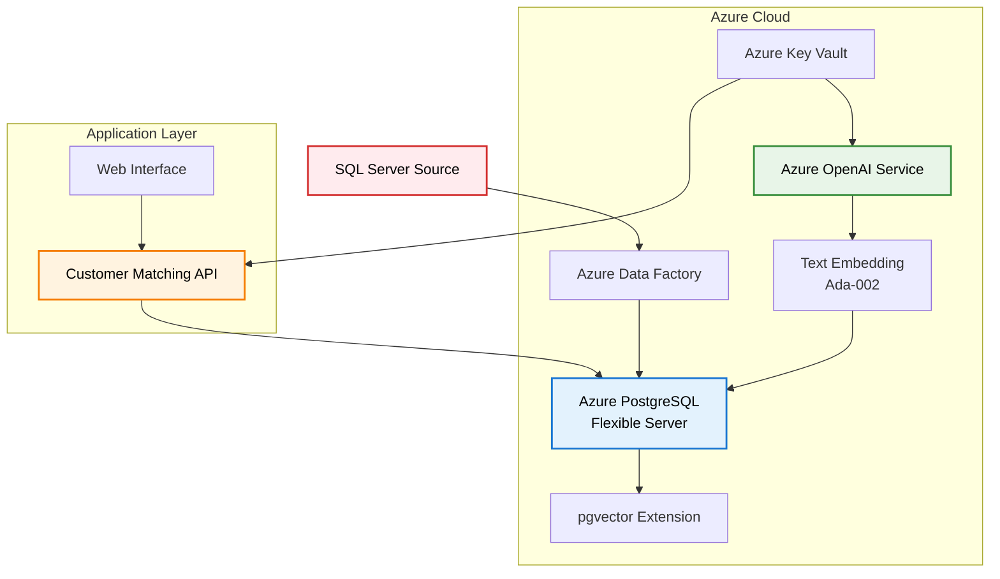

# Customer Matching POC - PostgreSQL with pgvector

A proof of concept for customer account matching using Azure Database for PostgreSQL with the pgvector extension and Azure OpenAI embeddings. This project demonstrates vector similarity search for intelligent customer matching with a modern, scalable architecture.

## 📋 Table of Contents

- [Overview](#overview)
- [Architecture](#architecture)
- [Features](#features)
- [Project Structure](#project-structure)
- [Quick Start](#quick-start)
- [Development Guide](#development-guide)
- [API Documentation](#api-documentation)
- [Deployment](#deployment)
- [Testing](#testing)
- [Migration Guide](#migration-guide)

## 🎯 Overview

This application provides intelligent customer matching capabilities using:
- **Vector Similarity Search**: PostgreSQL with pgvector extension for efficient similarity matching
- **Azure OpenAI Integration**: Generates embeddings using text-embedding-ada-002
- **RESTful API**: FastAPI-based service for customer matching operations
- **Modern Architecture**: Organized following Python best practices for maintainability and scalability

## 🏗️ Architecture



## ✨ Features

- **Vector Similarity Search**: Uses pgvector extension for efficient similarity matching
- **Azure OpenAI Integration**: Generates embeddings using text-embedding-ada-002
- **RESTful API**: FastAPI-based service for customer matching operations
- **Automated Matching**: PostgreSQL functions for intelligent customer matching
- **Multiple Match Types**: Exact, high confidence, potential, and low confidence matches
- **Web Interface**: Simple HTML interface for testing and exploration
- **Production Ready**: Includes security, monitoring, and scalability considerations
- **Modern Development**: Type hints, async support, comprehensive testing, and code quality tools

## 📁 Project Structure

```
az-vectordb/
├── app/                          # Main application package
│   ├── __init__.py
│   ├── main.py                  # FastAPI application entry point
│   ├── api/                     # API layer
│   │   ├── __init__.py
│   │   ├── v1/                  # API version 1
│   │   │   ├── __init__.py
│   │   │   ├── api.py           # Main API router
│   │   │   └── endpoints/       # API endpoints
│   │   │       ├── __init__.py
│   │   │       ├── customers.py # Customer endpoints
│   │   │       ├── health.py    # Health check endpoints
│   │   │       └── matching.py  # Matching endpoints
│   ├── core/                    # Core application components
│   │   ├── __init__.py
│   │   ├── config.py            # Configuration management
│   │   └── database.py          # Database connection and session management
│   ├── models/                  # Data models
│   │   ├── __init__.py
│   │   ├── database.py          # SQLAlchemy database models
│   │   └── schemas.py           # Pydantic API schemas
│   ├── services/                # Business logic services
│   │   ├── __init__.py
│   │   ├── embedding_service.py # Azure OpenAI embedding service
│   │   └── matching_service.py  # Customer matching service
│   └── utils/                   # Utility functions
│       ├── __init__.py
│       └── helpers.py           # Common helper functions
├── tests/                       # Test suite
│   ├── __init__.py
│   ├── conftest.py              # Pytest configuration and fixtures
│   ├── test_api.py              # API tests
│   ├── unit/                    # Unit tests
│   └── integration/             # Integration tests
├── scripts/                     # Utility scripts
│   ├── generate_customer_data.py
│   ├── generate_incoming_customers.py
│   └── import_customers.py
├── bicep/                       # Azure infrastructure templates
├── sql/                         # Database setup scripts
├── data/                        # Generated data files
├── docs/                        # Documentation
├── requirements.txt             # Production dependencies
├── requirements-dev.txt         # Development dependencies
└── pyproject.toml              # Modern Python packaging configuration
```

## 🚀 Quick Start

### Prerequisites

- Azure subscription with appropriate permissions
- Azure CLI installed and configured
- Python 3.9+ for the application
- PostgreSQL client tools (psql) for database setup
- Git for version control

### 1. Clone and Setup

```bash
git clone <repository-url>
cd az-vectordb
python -m venv .venv
source .venv/bin/activate  # On Windows: .venv\Scripts\activate
```

### 2. Install Dependencies

```bash
# For production
pip install -r requirements.txt

# For development
pip install -r requirements-dev.txt
# or
pip install -e ".[dev]"
```

### 3. Environment Configuration

Create a `.env` file in the `app` directory:

```env
# Database
POSTGRES_HOST=your-postgres-host
POSTGRES_PORT=5432
POSTGRES_USER=postgres
POSTGRES_PASSWORD=your-password
POSTGRES_DB=vectordb

# Azure OpenAI
AZURE_OPENAI_ENDPOINT=your-openai-endpoint
AZURE_OPENAI_API_KEY=your-api-key
AZURE_OPENAI_DEPLOYMENT_NAME=text-embedding-ada-002
```

### 4. Deploy Infrastructure (Optional)

If you need to deploy the Azure infrastructure:

```bash
# Make the deployment script executable
chmod +x deploy-infrastructure.sh

# Run the deployment
./deploy-infrastructure.sh
```

**⚠️ Important: Parameter File Security**

Before deploying, create your parameter file with actual values:

```bash
# Copy the template file
cp bicep/postgresql-pgvector.parameters.template.json bicep/postgresql-pgvector.parameters.json

# Edit with your actual values
# NEVER commit the .parameters.json file to source control!
```

Required parameter updates:
- `adminPassword`: Strong password for PostgreSQL admin
- `clientIpAddress`: Your current IP address for firewall access

### 5. Set Up Database

```bash
# Connect to PostgreSQL and run setup script
psql -h your-postgresql-server.postgres.database.azure.com -U pgadmin -d customer_matching -f sql/01-setup-pgvector.sql
psql -h your-postgresql-server.postgres.database.azure.com -U pgadmin -d customer_matching -f sql/02-functions.sql
```

### 6. Start Application

```bash
# Navigate to app directory
cd app

# Run the FastAPI application
python main.py
```

The application will be available at:
- **Web Interface**: http://localhost:8000
- **API Documentation**: http://localhost:8000/docs
- **Health Check**: http://localhost:8000/api/v1/health/

## 🛠️ Development Guide

### Key Improvements in Current Structure

#### 1. **Separation of Concerns**
- **API Layer**: Clean separation of endpoints by functionality
- **Business Logic**: Services handle complex business operations
- **Data Models**: Separate database models from API schemas
- **Configuration**: Centralized configuration management

#### 2. **Modern Python Practices**
- **Type Hints**: Comprehensive type annotations throughout
- **Async Support**: Proper async/await patterns
- **Error Handling**: Consistent error handling and logging
- **Validation**: Pydantic models for request/response validation

#### 3. **Testing Infrastructure**
- **Pytest**: Modern testing framework with fixtures
- **Test Coverage**: Comprehensive test coverage configuration
- **Mocking**: Proper mocking for external dependencies
- **Integration Tests**: Separate integration test suite

#### 4. **Development Tools**
- **Code Quality**: Black, flake8, mypy, isort, bandit
- **Pre-commit**: Automated code quality checks
- **Documentation**: MkDocs for documentation generation
- **Profiling**: Performance profiling tools

### Running the Application

#### Development Mode
```bash
# Using the organized structure
python -m app.main

# Or with uvicorn directly
uvicorn app.main:app --reload --host 0.0.0.0 --port 8000
```

#### Production Mode
```bash
uvicorn app.main:app --host 0.0.0.0 --port 8000 --workers 4
```

### Development Tools

#### Code Formatting
```bash
# Format code with Black
black app/ tests/

# Sort imports with isort
isort app/ tests/

# Type checking with mypy
mypy app/
```

#### Linting
```bash
# Run flake8
flake8 app/ tests/

# Run bandit for security
bandit -r app/
```

#### Pre-commit Hooks
```bash
# Install pre-commit hooks
pre-commit install

# Run all hooks
pre-commit run --all-files
```

## 📊 API Documentation

### Core Operations

| Method | Endpoint | Description |
|--------|----------|-------------|
| GET | `/` | Web interface |
| GET | `/api/v1/health/` | System health check |
| POST | `/api/v1/customers/` | Add new customer |
| GET | `/api/v1/customers/` | List all customers |
| POST | `/api/v1/customers/incoming` | Submit incoming customer |
| POST | `/api/v1/matching/{id}` | Process customer matching |
| GET | `/api/v1/matching/results/{id}` | Get matching results |
| POST | `/api/v1/customers/search` | Search customers by similarity |

### Example API Usage

#### Create a Customer
```bash
curl -X POST http://localhost:8000/api/v1/customers/ \
  -H "Content-Type: application/json" \
  -d '{
    "company_name": "Acme Corp",
    "contact_name": "John Smith",
    "email": "john.smith@acmecorp.com",
    "phone": "555-123-4567",
    "address_line1": "123 Main St",
    "city": "New York",
    "state": "NY",
    "postal_code": "10001",
    "country": "USA",
    "industry": "Technology",
    "annual_revenue": 10000000,
    "employee_count": 150,
    "website": "https://acmecorp.com",
    "description": "Leading technology solutions provider"
  }'
```

#### Search for Similar Customers
```bash
curl -X POST http://localhost:8000/api/v1/customers/search \
  -H "Content-Type: application/json" \
  -d '{
    "query_text": "technology company",
    "similarity_threshold": 0.8,
    "max_results": 10
  }'
```

## 📊 Generating and Importing Customer Data

### Generate and Import Sample Data

To generate and import sample customer data (500 records by default):

```bash
# Navigate to the app directory
cd app

# Import sample data with random embeddings (default)
python -m scripts.import_customers

# Import with a specific number of records
python -m scripts.import_customers --count 1000

# Use real OpenAI embeddings (requires valid API key in .env)
python -m scripts.import_customers --use-real-embeddings
```

### Import from External Files

You can also import customer data from CSV or JSON files:

```bash
# Import from CSV file
python -m scripts.import_customers --source path/to/customers.csv

# Import from JSON file
python -m scripts.import_customers --source path/to/customers.json

# Explicitly specify file format (optional, auto-detected from extension)
python -m scripts.import_customers --source data.csv --format csv
```

### File Formats

**CSV Format:**
```csv
company_name,contact_name,email,phone,address_line1,address_line2,city,state,postal_code,country,industry,revenue,employee_count,website,description
Acme Corp,John Smith,john.smith@acmecorp.com,555-123-4567,123 Main St,,New York,NY,10001,USA,Technology,10000000,150,https://acmecorp.com,Leading technology solutions provider
```

**JSON Format:**
```json
[
  {
    "company_name": "Acme Corp",
    "contact_name": "John Smith",
    "email": "john.smith@acmecorp.com",
    "phone": "555-123-4567",
    "address_line1": "123 Main St",
    "city": "New York",
    "state": "NY",
    "postal_code": "10001",
    "country": "USA",
    "industry": "Technology",
    "revenue": 10000000,
    "employee_count": 150,
    "website": "https://acmecorp.com",
    "description": "Leading technology solutions provider"
  }
]
```

## 🧪 Testing

### Run All Tests
```bash
pytest
```

### Run with Coverage
```bash
pytest --cov=app --cov-report=html
```

### Run Specific Test Categories
```bash
# Unit tests only
pytest tests/unit/

# Integration tests only
pytest tests/integration/

# API tests only
pytest tests/test_api.py
```

### Test Configuration

The project uses pytest with the following configuration:
- **Test paths**: `tests/`
- **Coverage**: Targets `app/` directory
- **Markers**: `slow`, `integration`, `unit`
- **Reports**: HTML, XML, and terminal coverage reports

## 🚀 Deployment

### Production Deployment

For production deployment, consider:

1. **Environment Variables**: Use Azure Key Vault or similar for secrets
2. **Database**: Use Azure Database for PostgreSQL with pgvector
3. **Application**: Deploy to Azure App Service or Container Instances
4. **Monitoring**: Set up Azure Monitor and Application Insights
5. **Scaling**: Configure auto-scaling based on load

### Docker Deployment

```dockerfile
FROM python:3.9-slim

WORKDIR /app
COPY requirements.txt .
RUN pip install -r requirements.txt

COPY app/ ./app/
COPY pyproject.toml .

EXPOSE 8000
CMD ["uvicorn", "app.main:app", "--host", "0.0.0.0", "--port", "8000"]
```

## 🔄 Migration Guide

> **⚠️ DEPRECATED**: This section is for users migrating from the old project structure. New users should follow the Quick Start guide above.

### What Changed

#### File Structure Changes

| Old Location | New Location | Purpose |
|--------------|--------------|---------|
| `app/main.py` | `app/main.py` | Main application entry point |
| `app/config.py` | `app/core/config.py` | Configuration management |
| `app/database.py` | `app/core/database.py` | Database connection management |
| `app/models.py` | `app/models/database.py` + `app/models/schemas.py` | Split into DB models and API schemas |
| `app/embedding_service.py` | `app/services/embedding_service.py` | Business logic service |
| `app/matching_service.py` | `app/services/matching_service.py` | Business logic service |
| `app/import/` | `scripts/` | Utility scripts moved |

#### API Endpoint Changes

| Old Endpoint | New Endpoint | Notes |
|--------------|--------------|-------|
| `/health` | `/api/v1/health/` | Added API versioning |
| `/customers` | `/api/v1/customers/` | Added API versioning |
| `/customers/incoming` | `/api/v1/customers/incoming` | Added API versioning |
| `/customers/match/{id}` | `/api/v1/matching/{id}` | Reorganized matching endpoints |
| `/customers/search` | `/api/v1/customers/search` | Added API versioning |
| `/matches/{id}` | `/api/v1/matching/results/{id}` | Reorganized matching endpoints |

### Migration Steps

1. **Update Environment**: Install new development dependencies
2. **Update API Calls**: Add `/api/v1/` prefix to endpoints
3. **Update Imports**: Use new package structure
4. **Test Application**: Verify all functionality works
5. **Update Scripts**: Modify any custom scripts

### Troubleshooting

- **Import Errors**: Update import statements to use new package structure
- **API 404 Errors**: Update endpoint URLs to include `/api/v1/` prefix
- **Database Issues**: Verify `.env` file and database credentials
- **Test Failures**: Update test imports and endpoint URLs

## 📈 Benefits of Current Structure

### 1. **Better Code Organization**
- Clear separation of concerns
- Easier to find and modify code
- Better maintainability

### 2. **Improved Development Experience**
- Modern development tools
- Automated code quality checks
- Better testing infrastructure

### 3. **Enhanced Scalability**
- Modular architecture
- API versioning support
- Service layer abstraction

### 4. **Production Readiness**
- Comprehensive error handling
- Better logging
- Health checks and monitoring

## 🤝 Contributing

1. Fork the repository
2. Create a feature branch
3. Make your changes
4. Run tests and code quality checks
5. Submit a pull request

## 📄 License

This project is licensed under the MIT License - see the LICENSE file for details.

## 🆘 Support

For issues and questions:
1. Check the documentation above
2. Review the API documentation at `/docs`
3. Check the logs for detailed error messages
4. Open an issue on GitHub

---

**Built with ❤️ using Azure, PostgreSQL, and Python**
