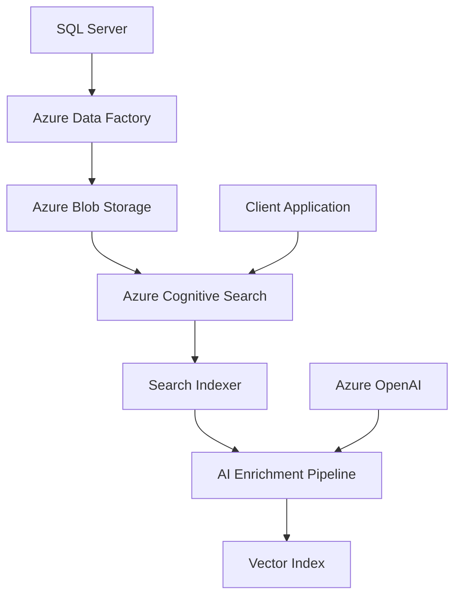
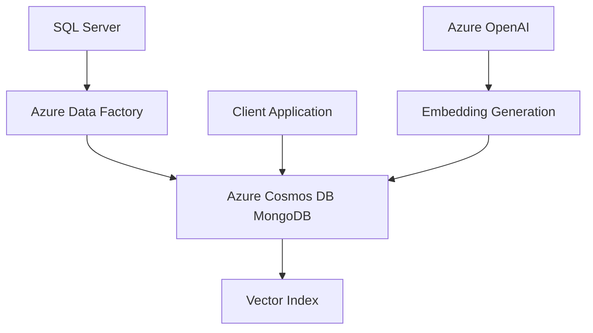
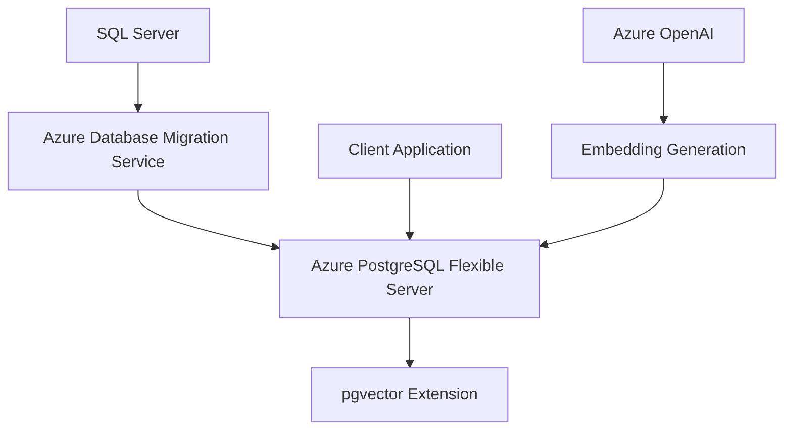
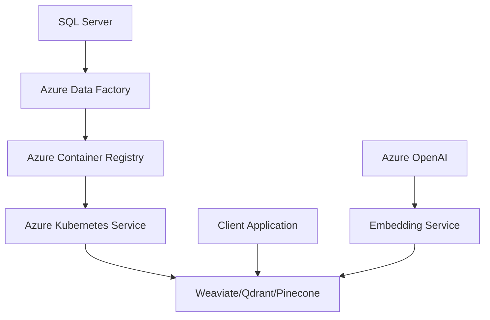

give me multiple options for setting up a proof of concept for a vector database.
i have tables in sql server and i want to use azure vector database to search through the data.
I want to be able to match an incoming customer account to the most likely account in the database.

# Azure Vector Database Solutions - Proof of Concept Options

## Overview of Azure Vector Database Services

Azure doesn't have a single "Azure Vector Database" service, but offers multiple options for implementing vector search capabilities:

### 1. **Azure Cognitive Search (Recommended for Most Use Cases)**
- **Native vector search** capabilities with hybrid search (keyword + vector)
- **Integrated AI enrichment** pipeline for content extraction and vectorization
- **Managed service** with automatic scaling and high availability
- **Cost-effective** for most enterprise scenarios
- **Built-in security** with Azure AD integration

### 2. **Azure Cosmos DB for MongoDB vCore**
- **Native vector search** support with MongoDB compatibility
- **Global distribution** capabilities
- **Multi-model** database (document, graph, vector)
- **Serverless and provisioned** throughput options

### 3. **Azure Database for PostgreSQL with pgvector**
- **Open-source pgvector extension** for vector operations
- **Familiar SQL interface** for existing SQL Server teams
- **Flexible server** with customizable configurations
- **Cost-effective** for smaller workloads

### 4. **Azure Container Instances/AKS with Vector Databases**
- **Self-managed** vector databases (Pinecone, Weaviate, Qdrant, Chroma)
- **Full control** over configuration and optimization
- **Higher operational overhead** but maximum flexibility

## Proof of Concept Architecture Options

### Option 1: Azure Cognitive Search (Recommended)

**Implementation Steps:**
1. Extract data from SQL Server using Azure Data Factory
2. Store documents in Azure Blob Storage
3. Configure Cognitive Search with vector fields
4. Set up indexer with AI enrichment pipeline
5. Use Azure OpenAI for embeddings generation

**Pros:**
- Minimal infrastructure management
- Built-in AI capabilities
- Hybrid search (keyword + semantic)
- Enterprise security and compliance

**Cons:**
- Less control over vector algorithms
- Pricing can be higher for large datasets

### Option 2: Azure Cosmos DB for MongoDB vCore

**Implementation Steps:**
1. Migrate/sync data from SQL Server to Cosmos DB
2. Generate embeddings using Azure OpenAI
3. Store documents with vector embeddings
4. Create vector indexes for similarity search
5. Implement search API

**Pros:**
- Global distribution
- MongoDB compatibility
- Integrated vector search
- Multi-model capabilities

**Cons:**
- Higher cost for large datasets
- Learning curve for MongoDB

### Option 3: PostgreSQL with pgvector

**Implementation Steps:**
1. Set up Azure PostgreSQL Flexible Server
2. Install pgvector extension
3. Migrate data from SQL Server
4. Add vector columns to existing tables
5. Generate and store embeddings
6. Create vector indexes

**Pros:**
- Familiar SQL interface
- Cost-effective
- Direct integration with existing data
- Open-source flexibility

**Cons:**
- Manual scaling and optimization
- Limited built-in AI features

### Option 4: Containerized Vector Database (Advanced)

**Implementation Steps:**
1. Deploy vector database on AKS
2. Set up data pipeline from SQL Server
3. Configure embedding generation service
4. Implement vector search APIs
5. Set up monitoring and scaling

**Pros:**
- Maximum flexibility and control
- Best performance for specialized use cases
- Choice of vector database technology

**Cons:**
- High operational complexity
- Requires container orchestration expertise

## Cost Comparison (Estimated Monthly for 1M documents)

| Solution | Estimated Cost | Complexity | Time to Deploy |
|----------|---------------|------------|----------------|
| Cognitive Search | $500-1500 | Low | 1-2 weeks |
| Cosmos DB MongoDB | $800-2000 | Medium | 2-3 weeks |
| PostgreSQL + pgvector | $200-600 | Medium | 2-4 weeks |
| AKS + Vector DB | $400-1200 | High | 4-8 weeks |

## Recommended POC Approach

### Phase 1: Quick Win (2 weeks)
Start with **Azure Cognitive Search** for fastest time-to-value:
- Use existing SQL Server data
- Leverage built-in AI enrichment
- Implement hybrid search capabilities

### Phase 2: Evaluation (4 weeks)
Compare with **PostgreSQL + pgvector**:
- More control over vector operations
- Cost optimization
- SQL familiarity for your team

### Phase 3: Production Decision
Based on POC results, choose the solution that best fits:
- Performance requirements
- Cost constraints
- Operational capabilities
- Scalability needs

## Next Steps for Your POC

1. **Define your use case**: What type of search/similarity matching do you need?
2. **Sample your data**: Start with a subset of your SQL Server tables
3. **Choose embedding model**: Azure OpenAI text-embedding-ada-002 or alternatives
4. **Set up basic pipeline**: Data extraction → Embedding generation → Vector storage
5. **Implement search interface**: REST API or web application for testing

Would you like me to help you implement any of these options or dive deeper into a specific approach?